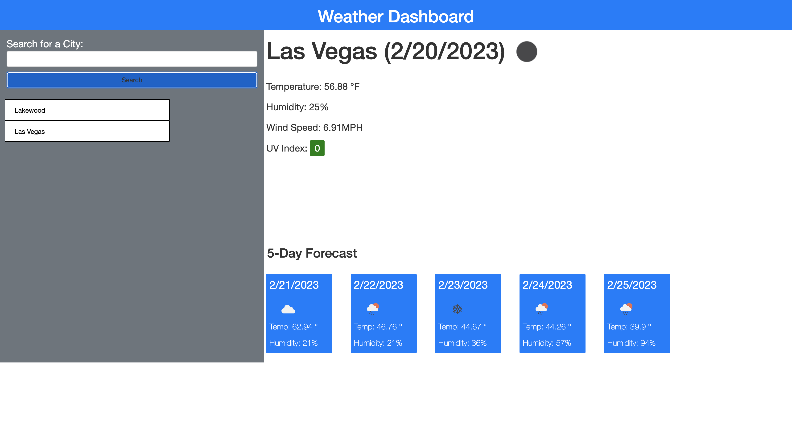

# Weather-Dashboard-Challenge
## Description
#
This app allows the user to view the weekly weather conditions for any city that they search for.

## Installation 
#
The web page was installed through pushing local html, css, javaScript, bootstrap, jquery, and the openweathermap API into github.

## Usage
#
The user inputs a city into the search bar. After submitting the city, the app fetches data from the openweathermap API and shows the city's temperature(also, its weather icon), wind speed, and humidty on the screen. If a city is unavailable, an alert pops up reminding the user to input a valid city.
## Credits
#
(https://openweathermap.org/)
## License
#
N/A
## Deployment Link 
#
(https://bignate38.github.io/Weather-Dashboard-Challenge/)

